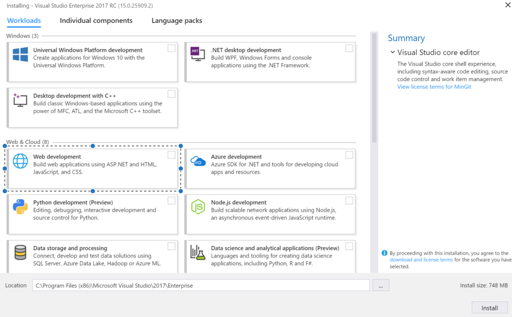

# Getting up and running following one of my samples.

**Note:** UofL students have access to VS and SSMS through DreamSpark..use that instead of following the links I provide!

## Install Visual Studio 2017
1. Go to http://www.visualstudio.com/downloads
2. Select a version of Visual Studio to download **Note:** Visual Studio 2017 Community is free!
3. Download the installer
4. Launch the installer
5. Select the type of installation
6. **Select the "Web Development" option under Web & Cloud ONLY!**

7. Click Install

## Installing SQL Server Management Studio 2014
1. Go to http://docs.microsoft.com/en-us/sql/ssms/download-sql-server-management-studio-ssms
2. Download the most up to date version of SQL Server Management Studio 2014
3. Run the installer
4. If the installer fails for .NET Framework 3.5 with Service Pack 1 follow steps 4a-4d:

      4a. Go to  http://www.microsoft.com/en-us/download/details.aspx?id=22
      
      4b. Hit download
      
      4c. Run the file to install .NET Framework 3.5 with SP 1 on your machine
      
      4d. Hit "retry" or something like that on the installer..
      
5. Once the installation finishes proceed.
6. Follow the "Checking SqlLocalDb Configuration" section
7. Open SSMS 2014
8. Follow the "Connecting to LocalDB from SQL Server Management Studio" section

## Creating and Commiting your first project.
1. Create a repository under your GitHub account.
2. Open Team Explorer in Visual Studio and clone that new repository.
3. Create a new "ASP .NET Web" project.
4. Uncheck "Create Git Repo".
5. Select the MVC template.
6. Uncheck "Unit Tests" (this time :)).
7. Click "Change Authentication"
8. Select "Individual User Accounts".
9. Then create the project.
10. Build the solution (Ctrl + Shift + B).
11. Run the solution.
12. If it builds and runs:

      Then go to "Team Explorer", Select the "Changes" tab.
      
      Enter a desciptive commit message and hit "Commit All" to commit your local changes.
      
      Then click 'Sync' to pull changes from the server.
      
      Then click 'Push' to push your committed changes to the server.  
      
13. If it throws an error on the web page with the following text:

      "A network-related or instance-specific error occurred while establishing a connection to SQL Server"
      
         Your LocalDb configuration is likely the cause, see "Checking LocalDb Configuration" section to resolve it.

## Checking SqlLocalDb Configuration
1. Open command prompt (Hit "Windows key" then "cmd" then "enter".
2. Enter "sqllocaldb" then hit "enter"
3. If you see the following error text:
    "'sqllocaldb' is not recognized as an internal or external command, operable program or batch file."
    
    You need to install SqlLocalDb on your machine, click the following link:
    
        For Sql Express 2014 - http://www.microsoft.com/en-us/download/details.aspx?id=42299
        
        For Sql Express 2016 - http://www.microsoft.com/en-us/sql-server/sql-server-editions-express
        
        or        
        Google "sql server express download" and select the version you want.
        Hit the download button
        Open the file
        Click "yes" to allow the app to make changes to your device.
        When prompted for installation type, select the "Download Media" option.
        Then, Select "LocalDB"
        Hit "Download"
        Then browse to the folder that the installer was downloaded to.
        Double click on the installer to open the installation wizard and follow the prompts.
        
4. After installing close open terminal windows and start back at step 1.
5. If you don't see the error text anymore, SQL Express is installed on your machine but we must verify the configuration now.
6. Run 'sqllocaldb info' in command prompt.
7. If you see the output 'MSSQLLocalDB' then SQL Express is installed and configured correctly for Entity Framework.
8. If you do not see 'MSSQLLocalDB' in command prompt then you must create an instance

      Run 'sqllocaldb create MSSQLLocalDB' in command prompt, then run 'sqllocaldb info' and see that 'MSSQLLocalDB' shows up.
    
## Connecting to LocalDB from SQL Server Management Studio

Server Type : Database Engine

Server Name : (LocalDb)\MSSQLLocalDB

Authentication : Windows Authentication

Then click connect!
